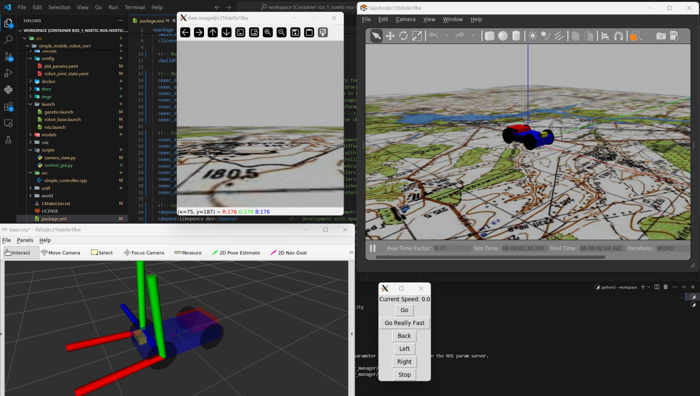

# Простая имитационная модель мобильного робота в ROS и Gazebo


**Аннотация**

В данной работе представлен процесс разработки и симуляции мобильного робота с использованием платформы ROS Noetic и среды Gazebo. Описано создание URDF-модели робота, которая включает в себя детальное описание всех его компонентов. Рассмотрена разработка Docker контейнера, что позволяет обеспечить унификацию и воспроизводимость среды разработки. Также описаны файлы конфигурации для управления моделью в Gazebo и настройка PID контроллеров для оптимизации управления движением. Проект включает в себя формирование собственного мира в Gazebo, что позволяет тестировать робота в контролируемой и настраиваемой среде.

**Введение**

Данная работа является идейным продолжение предыдущей работы - [Контроллер управления по типу Аккерманна на базе 4-колёсной мобильной платформы](https://habr.com/ru/articles/802069/).

Цель данной работы заключается в демонстрации процесса создания имитационных моделей для различных типов роботов и манипуляторов, осуществляемой на платформе ROS Noetic и в симуляционном окружении Gazebo. Основное внимание уделено разработке URDF-модели четырёхколёсного мобильного робота, проектированию соответствующего Docker контейнера для упрощения развертывания и конфигурации, а также интеграции с симуляционными средами для программирования и тестирования поведения робота.

В рамках этой работы осуществляется разработка Docker контейнера, который служит для стандартизации и воспроизводимости среды разработки и тестирования. Также выполняется создание URDF модели робота, которая подробно описывает все механические и визуальные аспекты робота. Разрабатываются файлы конфигурации, необходимые для управления поведением модели робота в Gazebo, а также файлы запуска, которые настраивают параметры и зависимости для инициализации симуляции и визуализации в ROS и Gazebo. Кроме того, формируется настраиваемый мир в Gazebo, предоставляющий тестовую среду для робота, и проводится настройка PID контроллеров для оптимизации управления движением робота.

Эта работа предназначена для помощи начинающим разработчикам в освоении процесса создания и тестирования имитационных моделей роботов, обеспечивая необходимую основу для дальнейших исследований и разработок в области робототехники. Предоставляемые материалы и методики предлагают практические знания и навыки, необходимые для разработки и внедрения сложных робототехнических систем.


**Содержание:**

- [Простая имитационная модель мобильного робота в ROS и Gazebo](#простая-имитационная-модель-мобильного-робота-в-ros-и-gazebo)
  - [1. В общих чертах об имитационном моделировании](#1-в-общих-чертах-об-имитационном-моделировании)
  - [2. Установка и настройка](#2-установка-и-настройка)
  - [3. Создание проекта](#3-создание-проекта)
    - [3.1 Создание рабочего пространства ROS (файлы конфигурации)](#31-создание-рабочего-пространства-ros-файлы-конфигурации)
  - [4. Проектирование описательной части мобильного робота](#4-проектирование-описательной-части-мобильного-робота)
    - [4.1 Описание структуры мобильного робота:](#41-описание-структуры-мобильного-робота)
    - [4.2 Описание файла конфигурации](#42-описание-файла-конфигурации)
    - [4.3 Проблемы с PID контроллерами в Gazebo](#43-проблемы-с-pid-контроллерами-в-gazebo)
  - [5. Написание ROS нод](#5-написание-ros-нод)
    - [5.1 Нода упралвения колёсами](#51-нода-упралвения-колёсами)
    - [5.2 Нода камеры](#52-нода-камеры)
  - [6. Описание формирования собственного мира дял Gazebo](#6-описание-формирования-собственного-мира-дял-gazebo)
  - [7. Описание файлов запуска](#7-описание-файлов-запуска)
  - [8. Симуляция в Gazebo и Rviz](#8-симуляция-в-gazebo-и-rviz)
  - [9. Заключение](#9-заключение)
  - [Цитирование](#цитирование)
  - [Контакты](#контакты)

**Исходный код:**

- [GitHub](https://github.com/AntonSHBK/mobile_robot_base_ros1).

**Полезные статьи:**
- [URDF tutorial](https://wiki.ros.org/urdf/Tutorials);
- [Xacro ROS docs](https://wiki.ros.org/xacro);
- [ROS Controls (official)](https://wiki.ros.org/ros_control);
- [ROS Controls (Gazebo)](https://classic.gazebosim.org/tutorials?tut=ros_control#Defaultgazebo_ros_controlBehavior);
- [Sdf, gazebo, world](https://classic.gazebosim.org/tutorials?tut=ros_roslaunch);
- [SDF format (описание используемых тегов)](http://sdformat.org/spec);
- [Ackermann steering geometry (Wikipedia)](https://en.wikipedia.org/wiki/Ackermann_steering_geometry);
- [ROS messages](https://wiki.ros.org/msg);
- [Geometry messages](https://docs.ros.org/en/api/geometry_msgs/html/index-msg.html);
- [Управление teleop_twist_keyboard](https://wiki.ros.org/teleop_twist_keyboard);
- [Roslaunch, управление запуском](http://docs.voltbro.ru/starting-ros/administrirovanie-ros/roslaunch.html);
- [Roslaunch tips for large projects](https://wiki.ros.org/ROS/Tutorials/Roslaunch%20tips%20for%20larger%20projects).


**Полезные видео:**
- [Practical Intro to ROS and URDF #1](https://www.youtube.com/watch?v=7rLXC4xvSGw)
- [Practical Intro to ROS and OpenCV #2](https://www.youtube.com/watch?v=2-Taue1Ue_8&t=1838s)


**Требования для использования Docker:**
- **Docker**: Установите последнюю версию Docker, которая позволяет создавать и управлять изолированными контейнерами на вашей машине.

**Требования для локальной настройки:**
- **Операционная система**: Ubuntu 20.04 LTS — официально поддерживаемая версия для ROS Noetic.
- **ROS Noetic**: Последняя версия ROS для Ubuntu 20.04, включающая все необходимые библиотеки и инструменты.
- **Gazebo**: Популярная среда для симуляции, взаимодействующая с ROS для реализации динамической и визуальной симуляции.
- 
**Общие требования:**
- **Текстовый редактор или интегрированная среда разработки (IDE)**: Для написания и редактирования кода (я  использую VS Code).
- **Базовые знания в области робототехники и программирования на Python или C++**: Для эффективной работы с ROS и создания скриптов управления.
- **Базовые знания фреймворка ROS**: Для понимания взаимосвязей.

    **Крайне рекомендую ознакомиться с [официальным туториалом Wiki ROS](https://wiki.ros.org/ROS/Tutorials).**

## 1. В общих чертах об имитационном моделировании

<details>
  <summary>Подробнее</summary>

В мире робототехники разработка и тестирование роботов является сложным и ресурсоёмким процессом. Создание реальных прототипов для экспериментальных целей может быть не только дорогостоящим, но и временным, особенно при работе с комплексными мобильными платформами, такими как четырёхколёсные роботы. Имитационное моделирование предоставляет возможность разработчикам проверять алгоритмы, дизайны и системы управления в контролируемой и безопасной среде, минимизируя физические риски и затраты.

Имитационные модели роботов позволяют осуществлять ряд важных задач:
1. **Тестирование алгоритмов управления**: Проверка и настройка систем управления и навигации в различных условиях.
2. **Исследование взаимодействия с окружающей средой**: Симуляция физических взаимодействий с миром, включая динамические объекты и переменные условия.
3. **Оптимизация конструкции**: Моделирование различных конфигураций и аппаратных спецификаций для улучшения производительности и эффективности.
4. **Обучение и демонстрация**: Использование в качестве образовательного инструмента для студентов и новых инженеров.

</details>

## 2. Установка и настройка

Я использую технологию контейнеризации **Docker** и рекомендую её вам (см. [пример моего использования](https://github.com/AntonSHBK/ROS-2-HUMBLE-DOCKER/tree/main)). Это позволяет избежать необходимости развёртывания полноценной виртуальной среды на основе Ubuntu. По причине того что Docker перестал функционирование на территории Росси я буду использовать VPN.  Для воспроизведения графического интерфейса приложений, таких как **Rviz** и **Gazebo**, используется [VcXsrv Windows X Server](https://sourceforge.net/projects/vcxsrv/).

Приведём описание `Dockerfile`, `docker-compose.yaml` и файла переменных окружения `.env`. Файлы располагаем в директории `docker` от корневой.

[Исходный код Dockerfile](https://github.com/AntonSHBK/mobile_robot_base_ros1/blob/main/docker/Dockerfile)

<details>
  <summary>Раскрыть код</summary>

```docker
# Использование базового образа ROS Noetic с предустановленными рабочим столом и основными инструментами
FROM osrf/ros:noetic-desktop

# Установка переменных среды для Python
ENV PYTHONDONTWRITEBYTECODE 1  # Предотвращает создание .pyc файлов
ENV PYTHONUNBUFFERED 1         # Предотвращает буферизацию вывода Python, улучшая логирование

# Настройка переменных среды для работы с NVIDIA GPU
ENV NVIDIA_VISIBLE_DEVICES \
    ${NVIDIA_VISIBLE_DEVICES:-all}
ENV NVIDIA_DRIVER_CAPABILITIES \
    ${NVIDIA_DRIVER_CAPABILITIES:+$NVIDIA_DRIVER_CAPABILITIES,}graphics

# Создание рабочей директории
RUN mkdir /workspace/src/mobile_robot_base_ros1 -p
WORKDIR /workspace

# Копирование проекта (какое то время у меня выдавало ошибку для этой команды)
COPY . /workspace/src/tractor_mobile_platform/

# Установка основных системных утилит
RUN apt-get update && \
    apt-get install -y \
    curl \        # Утилита командной строки для получения данных из сети
    wget \        # Утилита для скачивания файлов из интернета
    python3-pip \ # Менеджер пакетов Python
    python3-tk  \ # Пакеты длля tkinter

# Установка Gazebo 11 - симулятора для робототехники
RUN sudo sh -c 'echo "deb http://packages.osrfoundation.org/gazebo/ubuntu-stable `lsb_release -cs` main" > /etc/apt/sources.list.d/gazebo-stable.list'
RUN wget https://packages.osrfoundation.org/gazebo.key -O - | sudo apt-key add -
RUN sudo apt-get install -y libgazebo11-dev 
# Дополнительные пакеты Gazebo для интеграции с ROS
RUN apt-get update && \
    apt-get install -y \
    ros-noetic-gazebo-ros \
    ros-noetic-gazebo-ros-pkgs \
    ros-noetic-gazebo-ros-control

# Установка дополнительных пакетов ROS для управления и работы с роботами
RUN apt-get update && \
    apt-get install -y \
    ros-noetic-control-toolbox \
    ros-noetic-realtime-tools \
    ros-noetic-ros-controllers \
    ros-noetic-xacro \
    python3-wstool \
    ros-noetic-tf-conversions \
    ros-noetic-kdl-parser \
    liburdfdom-tools

# Установка инструментов для разработки
RUN apt-get update && \
    apt-get install -y \
    vim \
    git \
    tmux \
    tree 

# Установка зависимостей Python
COPY ../requirements.txt /tmp/requirements.txt
RUN pip install --upgrade pip
RUN pip install -r /tmp/requirements.txt

# Добавление источника ROS в .bashrc для удобства работы с оболочкой
RUN echo "source /opt/ros/noetic/setup.bash" >> ~/.bashrc
RUN echo "alias dros='source devel/setup.bash'" >> ~/.bashrc

# Завершение настройки
RUN echo "All done!"
```

</details>

[Исходный код docker-compose.yml](https://github.com/AntonSHBK/mobile_robot_base_ros1/blob/main/docker/docker-compose.yml)

<details>
  <summary>Раскрыть код</summary>

```yml
version: '4'  # Версия синтаксиса Docker Compose

name: mobile-robot-base-ros1  # Имя проекта

services:  # Определение сервисов, которые будут запущены в контейнерах
  ros-noetic-master:  # Название сервиса
    build:  # Инструкции для сборки образа
      context: ../  # Контекст сборки, базовый каталог для сборки
      dockerfile: ./docker/Dockerfile  # Путь к Dockerfile относительно контекста
    working_dir: /workspace  # Рабочая директория внутри контейнера
    volumes:  # Тома, подключаемые к контейнеру
      - ../:/workspace/src/mobile_robot_base_ros1  # Монтирование папки проекта из хоста в контейнер
    env_file:  # Файл с переменными окружения
      - ./.env  # Путь к файлу с переменными окружения
    tty: true  # Включение режима TTY, что позволяет использовать интерактивный терминал в контейнере
```

</details>

[Исходный код .env](https://github.com/AntonSHBK/mobile_robot_base_ros1/blob/main/docker/.env)

<details>
  <summary>Раскрыть код</summary>

```env
# Для настроек Docker
DISPLAY=host.docker.internal:0.0

# Различная настройка
LIBGL_ALWAYS_INDIRECT=0
UGID=1000:1000
```

</details>

<details>
  <summary>Раскрыть описание файла .env</summary>

Файл `.env` используется для определения переменных среды, которые могут быть прочитаны и использованы при конфигурации сервисов в `docker-compose`.
- `DISPLAY`: Эта переменная среды используется для настройки X11 forwarding между контейнером Docker и хост-машиной. Значение `host.docker.internal:0.0` указывает на адрес X сервера на хост-машине, позволяя графическим приложениям, запущенным в контейнере, отображаться на дисплее хоста. Это полезно при работе с графическими интерфейсами или симуляторами, такими как Gazebo в контексте ROS.
- `LIBGL_ALWAYS_INDIRECT`: Устанавливает, должны ли OpenGL команды передаваться непосредственно на GPU или должны быть обработаны через X сервер. Значение `0` отключает косвенную рендеринг через X сервер, что обычно используется для повышения производительности в графически интенсивных приложениях.
- `UGID`: Определяет UID (User ID) и GID (Group ID), которые должны быть использованы в контейнере. Это значение важно для управления правами доступа к файлам и ресурсам, особенно при монтировании внешних томов. Установка этой переменной гарантирует, что файлы, созданные внутри контейнера, будут иметь правильные владельца и группу на хост-системе, соответствующие UID и GID пользователя, что упрощает управление доступом к файлам и предотвращает проблемы с правами.

</details>

Перед запуском контейнера необходимо настроить и запустить **X server** (VcXsrv). Использование VcXsrv представляет собой простой и эффективный способ подключения графического интерфейса между контейнером Docker и вашей локальной машиной. Более подробную информацию можно найти [здесь](https://wiki.ros.org/docker/Tutorials/Compose).

Ознакомьтесь с подробной настройкой [ROS GUI](https://wiki.ros.org/docker/Tutorials/GUI). Если вам требуются дополнительные настройки, рекомендую прочитать [этот материал](https://habr.com/ru/companies/stc_spb/articles/657927/).

Этапы запуска X-сервера представлены на рисунках.

<details>
  <summary>Раскрыть рисунки</summary>

 | 
:---:|:---:
 | 

</details>

После запуска X server можно воспроизводить графический интерфейс из контейнера. 

    Важно: при запуске VcXsrv рекомендуется переключить язык интерфейса на английский, чтобы избежать проблем с заполнением текстовых полей в RViz.

Запуск и сборка проекта:
```bsuh
cd docker
docker-compose build
docker-compose up
```

**Полезные ресурсы:**

<!-- Для глубокого понимания и эффективного использования Docker, Docker Compose, а также файлов `.env` для управления переменными окружения, важно обращаться к официальным ресурсам. Вот некоторые полезные ссылки: -->

- **Официальная документация Docker**: [Docker Documentation](https://docs.docker.com/) - Это основной источник для всех аспектов Docker, включая установку, настройку, написание Dockerfile и многое другое.
<!-- - **Руководства и примеры**: [Get Started with Docker](https://docs.docker.com/get-started/) - Основной раздел для начинающих пользователей, который шаг за шагом ведет через основы работы с Docker.
- **Официальная документация Docker Compose**: [Overview of Docker Compose](https://docs.docker.com/compose/) - Обзор и основы Docker Compose, включая информацию о том, как управлять многоконтейнерными Docker приложениями.
- **Использование переменных окружения в Docker Compose**: [Environment variables in Compose](https://docs.docker.com/compose/environment-variables/) - Описание того, как управлять переменными окружения через Docker Compose, включая использование файлов `.env`.
- **Подробное описание работы с файлами `.env`**: [Declare default environment variables in file](https://docs.docker.com/compose/env-file/) - Спецификация использования файлов `.env` для задания переменных окружения по умолчанию в контексте Docker Compose. -->
- **Официальное руководство по использованию ROS с Docker**: [ROS и Docker](https://wiki.ros.org/docker/Tutorials/Docker)
- **Настройка Docker-контейнеров для Gazebo**: Этот ресурс предоставляет информацию о том, как настроить Docker для работы с Gazebo, что особенно полезно при проведении комплексных симуляций в различных средах. [Gazebo и Docker](https://github.com/osrf/docker_images)

Если вас есть необходимость развернуть проект локально или в виртуальной среде, ниже приведены ссылки на официальные ресурсы, которые помогут вам правильно установить и настроить все необходимые компоненты.

<details>
  <summary>Подробнее о локальной настройке среды</summary>

**Установка ROS Noetic**
ROS Noetic — это последняя версия ROS, предназначенная для работы с Ubuntu 20.04 LTS. Установка ROS Noetic требует тщательного следования инструкциям, чтобы обеспечить правильную интеграцию всех компонентов.

- **Официальные инструкции по установке ROS Noetic на Ubuntu**: [Установка ROS Noetic](http://wiki.ros.org/noetic/Installation/Ubuntu)

**Установка Gazebo**
Gazebo — мощная среда для симуляции, которая тесно интегрируется с ROS для создания детализированных и реалистичных имитационных моделей. 

- **Инструкции по установке Gazebo**: [Установка Gazebo](http://gazebosim.org/tutorials?tut=install_ubuntu&cat=install)

**Создание рабочего пространства ROS**
Для разработки проектов на ROS необходимо создать специальное рабочее пространство, которое будет содержать все пакеты и программы.

- **Инструкции по созданию рабочего пространства в ROS**: [Создание рабочего пространства ROS](http://wiki.ros.org/catkin/Tutorials/create_a_workspace)

<!-- Эти ресурсы помогут вам правильно установить и настроить все необходимые инструменты для начала работы над имитационной моделью четырёхколёсного робота. Придерживайтесь официальных руководств для избежания возможных проблем при установке и настройке. -->

</details>

## 3. Создание проекта

**Структура проекта**
Первоначально структура вашего проекта должна быть чётко организована для обеспечения лёгкости в управлении и последующем развитии.

Пример моей реализации структуры проекта:

<details>
  <summary>Раскрыть структуру проекта</summary>

```txt
│   CMakeLists.txt          # Файл для настройки сборки проекта с использованием CMake
│   LICENSE                 # Лицензионный файл
│   package.xml             # Файл манифеста пакета ROS, описывает зависимости и метаданные пакета
│   README.md               # Файл с описанием проекта и инструкциями по использованию
│   requirements.txt        # Файл с описанием зависимостей Python для установки через pip
|
├───config                  # Папка с конфигурационными файлами
│       pid_params.yaml     # Конфигурационный файл с параметрами ПИД-регулятора
│       robot_joint_state.yaml  # Конфигурационный файл с состоянием суставов робота
|
├───docker                  # Папка с файлами для Docker-контейнера
│       .env                # Файл с переменными окружения для Docker
│       docker-compose.yml  # Файл для настройки Docker Compose
│       Dockerfile          # Файл для сборки Docker-образа
|
├───launch                  # Папка с файлами запуска для ROS Launch
│       gazebo.launch       # Файл для запуска симуляции в Gazebo
│       robot_base.launch   # Файл для запуска базовых узлов робота
│       rviz.launch         # Файл для запуска RViz для визуализации
|
├───models                  # Папка с моделями для симуляции
│   └───map_ground          # Подпапка с моделью для карты земли
│       │   model.config    # Файл конфигурации модели
│       │   model.sdf       # Файл описания модели в формате SDF
│       │
│       └───materials       # Подпапка с материалами модели
│           ├───scripts     # Подпапка со скриптами для материалов
│           │       map_ground.material  # Файл материала для карты земли
│           │
│           └───textures    # Подпапка с текстурами для материалов
│                   map.jpg # Файл с текстурой для карты земли
|
├───rviz                    # Папка с файлами конфигурации для RViz
│       base.rviz           # Файл конфигурации RViz для базовой визуализации
|
├───scripts                 # Папка со скриптами
│       camera_view.py      # Скрипт для просмотра изображений с камеры
|       control_gui.py      # Скрипт для графического интерфеиса управления
|
├───src                     # Папка с исходным кодом C++
│       simple_controller.cpp  # Пример простого контроллера на C++
|
└───urdf                    # Папка с файлами Xacro для описания URDF модели робота
|        camera.xacro        # Файл с описанием камеры в формате Xacro
|        common_macro.xacro  # Файл с общими макросами Xacro
|        control_block.xacro # Файл с описанием блока управления в формате Xacro
|        corpus.xacro        # Файл с описанием корпуса робота в формате Xacro
|        main.xacro          # Основной файл сборки модели робота в формате Xacro
|        wheel.xacro         # Файл с описанием колеса робота в формате Xacro
|
└───world                   # Папка с файлами мира для симуляции
        empty_world.world   # Файл с описанием пустого мира для симуляции
```

</details>

### 3.1 Создание рабочего пространства ROS (файлы конфигурации)

Для создания пакета ROS, вы можете следовать официальным руководствам, которые предоставляют подробные инструкции и примеры. Ниже представлены ссылки на ресурсы, которые помогут вам в этом процессе:
- [Простой пример создания пакета](https://wiki.ros.org/ROS/Tutorials/CreatingPackage)
- [Создание пакета ROS вручную](https://wiki.ros.org/ROS/Tutorials/Creating%20a%20Package%20by%20Hand)
- [Подробное описание CMakeLists.txt](http://wiki.ros.org/catkin/CMakeLists.txt)

В качестве примера, ниже приведены файлы `CMakeLists.txt` и `package.xml` из моего ROS пакета, которые демонстрируют настройку и зависимости проекта. Эти файлы настраивают среду для корректной работы и управления зависимостями в вашем ROS проекте.

[Исходный код CMakeLists.txt](https://github.com/AntonSHBK/mobile_robot_base_ros1/blob/main/CMakeLists.txt):

<details>
  <summary>Раскрыть код</summary>

```cmake
# Устанавливаем минимально требуемую версию CMake
cmake_minimum_required(VERSION 3.0.2)

# Задаем имя проекта
project(mobile_robot_base_ros1)

# Ищем пакеты catkin, требуемые для проекта
find_package(catkin REQUIRED COMPONENTS
    roscpp
    rospy
    std_msgs
    message_generation
    sensor_msgs
    cv_bridge
    image_transport
)

# Дополнительный поиск компонентов catkin и библиотек OpenCV
find_package(catkin REQUIRED COMPONENTS
    ${PKG_DEPS}
    ${OpenCV_INCLUDE_DIRS}
)

# Находим необходимую версию пакета OpenCV
find_package(OpenCV 4.2.0 REQUIRED)

# Определяем пакет catkin
catkin_package()

# Добавляем директории с заголовочными файлами
include_directories(
    include 
    ${catkin_INCLUDE_DIRS}
    ${OpenCV_INCLUDE_DIRS}
)

# Устанавливаем Python скрипты
catkin_install_python(
    PROGRAMS
    scripts/camera_view.py
    scripts/control_gui.py
    DESTINATION ${CATKIN_PACKAGE_BIN_DESTINATION}
)

# Добавляем исполняемый файл из указанного исходного файла
add_executable(simple_motor_controller src/simple_controller.cpp)

# Связываем исполняемый файл с библиотеками
target_link_libraries(
    simple_motor_controller 
    ${catkin_LIBRARIES}
)
```

</details>

[Исходный код package.xml](https://github.com/AntonSHBK/mobile_robot_base_ros1/blob/main/package.xml):

<details>
  <summary>Раскрыть код</summary>

```xml
<?xml version="1.0"?>
<package format="2">
  <!-- Основная информация о пакете -->
  <name>mobile_robot_base_ros1</name>
  <version>0.0.1</version>
  <description>Base project for mobile platform</description>
  <maintainer email="anton42@yandex.ru">Anton Pisarenko</maintainer>
  <license>MIT</license>

  <!-- Зависимость от инструмента сборки -->
  <buildtool_depend>catkin</buildtool_depend>

  <!-- Зависимости, необходимые для выполнения -->
  <exec_depend>roscpp</exec_depend>               <!-- C++ клиентская библиотека для ROS -->
  <exec_depend>rospy</exec_depend>                 <!-- Python клиентская библиотека для ROS -->
  <exec_depend>rviz</exec_depend>                  <!-- Визуализация 3D сцен в ROS -->
  <exec_depend>std_msgs</exec_depend>              <!-- Стандартные сообщения ROS -->
  <exec_depend>tf</exec_depend>                    <!-- Библиотека для преобразования координат -->
  <exec_depend>urdf</exec_depend>                  <!-- Парсер для URDF файлов -->
  <exec_depend>xacro</exec_depend>                 <!-- Макроязык для URDF -->

  <!-- Контроллеры и инструменты для работы с Gazebo и ROS -->
  <exec_depend>controller_manager</exec_depend>    <!-- Управление контроллерами в ROS -->
  <exec_depend>diff_drive_controller</exec_depend> <!-- Контроллер для дифференциального управления -->
  <exec_depend>gazebo_ros</exec_depend>            <!-- Интеграция ROS с симулятором Gazebo -->
  <exec_depend>gazebo_ros_control</exec_depend>    <!-- Плагины для управления роботами в Gazebo -->
  <exec_depend>joint_state_controller</exec_depend>  <!-- Контроллер состояний сочленений -->
  <exec_depend>position_controllers</exec_depend>  <!-- Контроллеры позиции -->
  <exec_depend>velocity_controllers</exec_depend>  <!-- Контроллеры скорости -->
  <exec_depend>robot_state_publisher</exec_depend> <!-- Публикация состояний робота -->
  <exec_depend>rqt_robot_steering</exec_depend>    <!-- Интерфейс управления роботом -->

  <!-- Общие зависимости для сборки и выполнения -->
  <depend>geometry_msgs</depend>                   <!-- Сообщения для геометрических данных -->
  <depend>libopencv-dev</depend>                   <!-- Разработка с OpenCV -->
  <depend>cv_bridge</depend>                       <!-- Мост между ROS и OpenCV -->
  <depend>image_transport</depend>                 <!-- Транспортировка изображений в ROS -->
  <depend>video_stream_opencv</depend>             <!-- Видеопотоки с использованием OpenCV -->
  <depend>python3-opencv</depend>                  <!-- Модуль OpenCV для Python 3 -->

  <!-- Тег export используется для определения дополнительных параметров пакета -->
  <export>
    <!-- Пути к моделям и медиафайлам для Gazebo -->
    <gazebo_ros gazebo_model_path="${prefix}/models" />
    <gazebo_ros gazebo_media_path="${prefix}/models" />
    <gazebo_ros gazebo_model_path="${prefix}/world" />
    <gazebo_ros gazebo_media_path="${prefix}/world" />
  </export>

</package>

```

</details>

## 4. Проектирование описательной части мобильного робота

**Общий план работ**

В процессе разработки имитационной модели робота мы начнём с описания частей робота с использованием формата `xacro`. Это позволит нам максимально гибко настраивать и масштабировать каждую часть модели. Параллельно с этим мы начнём создание `launch` файлов, применяя также принцип декомпозиции для разделения функциональности: `robot_base.launch` для основных настроек робота, `rviz.launch` для настройки и запуска визуализации в Rviz, и `gazebo.launch` для запуска симуляции в Gazebo.

После завершения описания всех компонентов робота перейдём к созданию файла конфигурации в формате `yaml`, например, `robot_joint_state.yaml`. Этот файл будет содержать информацию о состояниях сочленений и других параметрах, необходимых для корректной работы симуляции.

Далее, мы сформируем собственный мир для Gazebo, который будет адаптирован под задачи и особенности нашего робота. Это позволит нам провести первичные тесты в контролируемой и настроенной среде.

После первого запуска и базовой проверки работоспособности модели начнём разработку управляющих нод: создадим ноду контроллера для управления движением по принципу дифференциального управления обеими осями колёс, а также ноду для управления камерой, используя библиотеку OpenCV.

Завершим процесс интеграцией и тестированием всех компонентов, дополнив и адаптировав `launch` файлы для удобства запуска всей системы. Этот подход позволит нам систематически проверить каждый аспект функционирования робота и убедиться в его эффективности и готовности к более сложным задачам.

**Форматы URDF, XACRO и SDF**

Разработка имитационной модели робота в ROS начинается с проектирования его структуры в формате URDF (Unified Robot Description Format), который включает описание звеньев, соединений, массо-инерционных характеристик и других физических свойств, а также трансмиссии.

<!-- В проектах ROS рекомендуется использовать формат URDF для описания роботов. Однако для сложных конфигураций и моделирования в симуляционной среде Gazebo может потребоваться формат SDF, который предоставляет дополнительные возможности. Процесс формирования файла проходит через преобразования `xacro -> urdf -> sdf`, при этом конечный продукт для работы в ROS — это файл SDF. Для изучения доступных тегов при описании файла можно обратиться к [официальной документации](http://sdformat.org/spec). -->

<details>
  <summary>Подробнее о том что такое URDF, XACRO и SDF</summary>
    
**URDF (Unified Robot Description Format)**

URDF — это XML-формат, используемый для описания всех аспектов робототехнических систем в ROS. Он описывает физические свойства модели, включая размеры, форму, материалы, а также динамические и кинематические аспекты. URDF обычно используется для статических и неизменяемых описаний.

- **Официальные ресурсы**: 
  - [URDF в ROS Wiki](http://wiki.ros.org/urdf)

**XACRO (XML Macro)**

XACRO является расширением URDF и предоставляет возможность создавать более чистые и модульные описания, используя макросы XML для упрощения и повторного использования кода. XACRO улучшает управляемость и поддержку сложных файлов URDF, что делает его идеальным для больших робототехнических систем.

- **Официальные ресурсы**: 
  - [XACRO в ROS Wiki](http://wiki.ros.org/xacro)

**SDF (Simulation Description Format)**

SDF — это формат, разработанный специально для описания объектов и сред, используемых в симуляционных программах типа Gazebo. В отличие от URDF, SDF поддерживает описание не только роботов, но и целых сред, динамических свойств объектов, освещения, физики и других аспектов, что делает его особенно подходящим для комплексных симуляций.

- **Официальные ресурсы**: 
  - [SDF на сайте Gazebo](http://sdformat.org/)

**Полезные ресурсы при проектировании моделей**

При работе с этими форматами, особенно для новичков, могут быть полезны следующие ресурсы:

- **Учебные пособия по URDF и XACRO**:
  - [URDF Tutorials на ROS Wiki](http://wiki.ros.org/urdf/Tutorials)
  - [XACRO Tutorials на ROS Wiki](http://wiki.ros.org/xacro#Tutorials)

- **Примеры и шаблоны для SDF**:
  - [Gazebo Tutorials](http://gazebosim.org/tutorials/)
  - [Примеры моделей SDF](https://github.com/osrf/gazebo_models)

Эти ресурсы помогут вам понять основы каждого из этих форматов, а также предоставят инструменты и примеры, которые могут быть использованы в качестве отправной точки для создания собственных робототехнических моделей и симуляционных сред.

</details>

Для улучшения масштабируемости и гибкости проекта структура робота декомпозирована на несколько файлов в директории `urdf`:

- **`main.xacro`** — основной файл, который описывает робота и интегрирует все другие файлы (xacro);
- **`common_macro.xacro`** — файл, содержащий повторно используемые фрагменты кода и глобальные переменные, применимые для других файлов;
- **`corpus.xacro`** и **`wheel.xacro`** — файлы, описывающие корпус и колёса соответственно;
- **`camera.xacro`** — файл, описывающий камеру, интегрированную в робота, что позволяет моделировать визуальное восприятие окружающей среды;
- **`control_block.xacro`** — файл, содержащий описание условного блока управления, в данной роботе не несёт функционального назначения.

<details>
  <summary>Подробнее о применении декомпозиции</summary>

Такая декомпозиция обеспечивает чёткую организацию файлов и упрощает возможные дальнейшие модификации каждого элемента робота. Каждый компонент описан отдельно, что облегчает управление и позволяет легко вносить изменения в конструкцию, не затрагивая другие части проекта.

Мы используем формат `xacro` для описания робота, поскольку он обеспечивает расширенные возможности и улучшает масштабируемость кода. Файлы размещаем в директории `urdf` в корне проекта, чтобы облегчить другим разработчикам понимание структуры, где хранится описание робота.

Принятие данного принципа декомпозиции основано на идее, что каждый уникальный элемент конструкции должен быть представлен отдельно, аналогично разделению на детали и сборочные единицы при традиционном проектировании. Это упрощает управление компонентами и их возможные модификации.

Для начальной конструкции робота выбраны простые геометрические формы: корпус в виде параллелепипеда и колёса в форме цилиндров. В будущем эти базовые формы могут быть заменены на более сложные модели, используя файлы в форматах `stl` или `dae`, если потребуется более детальная визуализация или функциональность.

</details

### 4.1 Описание структуры мобильного робота:

Файл `common_macro.xacro` представляет собой набор макросов, разработанных для упрощения и стандартизации описания инерционных характеристик и трансмиссий различных элементов робота в формате URDF.

[Исходный код common_macro.xacro:](https://github.com/AntonSHBK/mobile_robot_base_ros1/blob/main/urdf/common_macro.xacro)

<!-- <details>
  <summary>Подробнее о файле</summary>

В робототехнике, точное определение инерционных характеристик  важно для корректного моделирования динамики движения. Инерционные параметры включают массу и моменты инерции, которые описывают распределение массы относительно центра масс объекта. Моменты инерции важны для расчётов, связанных с вращением объектов:

- **Цилиндр** и **сфера**: Используются формулы для расчёта моментов инерции, которые учитывают радиус и высоту (для цилиндра) или радиус (для сферы). Эти формулы обеспечивают точное представление динамических свойств тел вращения.
- **Параллелепипед** и **продолговатый цилиндр**: Для таких форм используются расчеты, учитывающие трехмерные пропорции тела, обеспечивая адекватное моделирование их поведения при вращательных и переходных движениях.

Трансмиссии в URDF важны для связывания механических актуаторов (например, двигателей) с соединениями робота, определяя, как движение актуатора преобразуется в движение соединений. В `common_macro.xacro` включены примеры макросов трансмиссий, которые определяют тип интерфейса оборудования для каждого соединения, такие как `VelocityJointInterface` для контроля скорости и `PositionJointInterface` для управления позицией.

Использование подобного подхода проектирования позволяет разработчикам:
- **Стандартизировать компоненты**: Обеспечивает консистентность и повторное использование инерционных моделей и трансмиссий в различных частях проекта.
- **Упрощение изменений**: Модификация одного макроса в `common_macro.xacro` автоматически применяется ко всем моделям, использующим этот макрос, что сокращает время на доработку и тестирование.
- **Чистота и организованность кода**: Сокращает дублирование кода и делает файлы URDF более читаемыми и управляемыми.

</details> -->

<details>
  <summary>Раскрыть код</summary>

```xml
<?xml version="1.0"?>
<robot name="mobile_robot_base" xmlns:xacro="http://www.ros.org/wiki/xacro">

<!-- *********************************************************************** -->
<!-- Макрос для инерционной модели цилиндра -->
<xacro:macro name="cylinder_inertia" params ="m r h">
  <inertial>
   <mass value="${m}"/> <!-- Масса цилиндра -->
   <!-- Формулы для вычисления моментов инерции для цилиндра -->
   <inertia ixx="${m*(3*r*r+h*h)/12}"  ixy="0.0" ixz="0.0"
            iyy="${m*(3*r*r+h*h)/12}"  iyz="0.0" izz="${m*r*r/2}"/>
   </inertial>
</xacro:macro>

<!-- *********************************************************************** -->
<!-- Макрос для инерционной модели базы -->
<xacro:macro name= "inertial_matrix" params="mass">
  <inertial>
    <mass value="${mass}"/> <!-- Масса базы -->
    <!-- Установка единичной матрицы для моментов инерции -->
    <inertia 
        ixx="1.0" ixy="0.0"
        iyy="1.0" iyz="0.0"
        izz="1.0" ixz="0.0"/>
   </inertial>
 </xacro:macro>

<!-- *********************************************************************** -->

<!-- Макрос для инерционной модели сферы -->
<xacro:macro name="inertial_sphere" params="mass radius *origin">
    <inertial>
        <xacro:insert_block name="origin"/>
        <mass value="${mass}" /> <!-- Масса сферы -->
        <!-- Формулы для вычисления моментов инерции для сферы -->
        <inertia ixx="${(2/5) * mass * (radius*radius)}" ixy="0.0" ixz="0.0"
                iyy="${(2/5) * mass * (radius*radius)}" iyz="0.0"
                izz="${(2/5) * mass * (radius*radius)}" />
    </inertial>
</xacro:macro>  


<xacro:macro name="inertial_box" params="mass x y z *origin">
    <inertial>
        <xacro:insert_block name="origin"/>
        <mass value="${mass}" /> <!-- Масса параллелепипеда -->
        <!-- Формулы для вычисления моментов инерции для параллелепипеда -->
        <inertia ixx="${(1/12) * mass * (y*y+z*z)}" ixy="0.0" ixz="0.0"
                iyy="${(1/12) * mass * (x*x+z*z)}" iyz="0.0"
                izz="${(1/12) * mass * (x*x+y*y)}" />
    </inertial>
</xacro:macro>


<xacro:macro name="inertial_cylinder" params="mass length radius *origin">
    <inertial>
        <xacro:insert_block name="origin"/>
        <mass value="${mass}" /> <!-- Масса цилиндра -->
        <!-- Формулы для вычисления моментов инерции для цилиндра -->
        <inertia ixx="${(1/12) * mass * (3*radius*radius + length*length)}" ixy="0.0" ixz="0.0"
                iyy="${(1/12) * mass * (3*radius*radius + length*length)}" iyz="0.0"
                izz="${(1/2) * mass * (radius*radius)}" />
    </inertial>
</xacro:macro>


<!-- *********************************************************************** -->
<!-- Блок трансмиссии для вращения цилиндра -->
<xacro:macro name="Transmission_rotation_block" params="joint_name">
    <transmission name="${joint_name}_rotation_trans">
        <type>transmission_interface/SimpleTransmission</type>
        <actuator name="${joint_name}_motor">
            <mechanicalReduction>1</mechanicalReduction>
        </actuator>
        <joint name="${joint_name}">
            <hardwareInterface>hardware_interface/VelocityJointInterface</hardwareInterface>
        </joint>
    </transmission>
</xacro:macro>

<!-- *********************************************************************** -->
<!-- Фиксированный блок трансмиссии для вращения цилиндра -->
<xacro:macro name="Fixed_rotation_block" params="joint_name">
    <transmission name="${joint_name}_fixed_rotation">
        <type>transmission_interface/SimpleTransmission</type>
        <actuator name="$${joint_name}_motor">
          <mechanicalReduction>1</mechanicalReduction>
        </actuator>
        <joint name="${joint_name}">
          <hardwareInterface>hardware_interface/PositionJointInterface</hardwareInterface>
        </joint>
      </transmission>
</xacro:macro>
</robot>
```

</details>

Файл `wheel.xacro` включает макросы для создания колёс и шарниров колес мобильного робота.

[Исходный код wheel.xacro:](https://github.com/AntonSHBK/mobile_robot_base_ros1/blob/main/urdf/wheel.xacro)

<!-- <details>
  <summary>Подробнее о файле</summary>

**Описание макроса для колеса.**

- **`xacro:macro name="wheel"`**: Макрос определяет структуру и свойства колеса.
- **`link name="${link_name}"`**: Каждое колесо определяется как отдельный элемент (link), что позволяет его идентифицировать и управлять им в модели робота.
- **Визуальное представление**: Использует цилиндр как геометрическую форму, что адекватно для колеса, с заданными радиусом и длиной.
- **Материал**: Задаётся черный цвет для колеса, что обычно используется для визуализации колёсных элементов.
- **Коллизионное представление**: Совпадает с визуальным для обеспечения точного моделирования столкновений.
- **Инерционные характеристики**: Вычисляются с использованием макроса `cylinder_inertia`, который рассчитывает массу и моменты инерции на основе размеров и массы колеса.

**Описание макроса для шарнира колеса**

- **`xacro:macro name="wheel_hinge"`**: Определяет шарнир, который может использоваться для соединения колеса с основной структурой робота.
- **Визуальное представление**: Шарнир также представлен в виде цилиндра, но с меньшими размерами, и окрашен в зелёный цвет для лёгкости идентификации.
- **Инерционные характеристики**: Аналогично колесам, для шарнира рассчитывается инерция, что важно для точного моделирования его поведения в динамике.

Использование xacro для описания колёс и шарниров обеспечивает высокую степень модульности и переиспользования кода.

</details> -->

<details>
  <summary>Раскрыть код</summary>

```xml
<?xml version="1.0"?>
<robot name="mobile_robot_base" xmlns:xacro="http://www.ros.org/wiki/xacro">

<xacro:include filename="$(find mobile_robot_base_ros1)/urdf/common_macro.xacro" />

<!-- *********************************************************************** -->

<!-- Описание макроса для создания колеса -->
<xacro:macro 
    name="wheel" 
    params="
        link_name
        radius 
        length 
        mass">
    <link name="${link_name}">
        <!-- Визуальное представление колеса -->
        <visual>
            <origin rpy="0 0 0" xyz="0 0 0"/> 
            <geometry>
                <cylinder length="${length}" radius="${radius}"/>
            </geometry>
            <!-- Материал для визуализации в черном цвете -->
            <material name="Black">
                <color rgba="0.0 0.0 0.0 0.9"/>
            </material>
        </visual>
        <!-- Коллизионное представление колеса -->
        <collision>
            <origin rpy="0 0 0" xyz="0 0 0"/> 
            <geometry>
                <cylinder length="${length}" radius="${radius}"/>
            </geometry>
        </collision>
        <!-- Вычисление инерции для колеса -->
        <xacro:cylinder_inertia m="${mass}" r="${radius}" h="${length}"/>
    </link>
    <!-- Указание материала для визуализации в среде Gazebo -->
    <gazebo reference ="${link_name}">
        <material>Gazebo/Black</material>
     </gazebo> 
</xacro:macro>

<!-- *********************************************************************** -->

<!-- Описание макроса для создания шарнира колеса -->
<xacro:macro 
    name="wheel_hinge" 
    params="link_name">
    <link name="${link_name}">
        <!-- Визуальное представление шарнира -->
        <visual>
            <origin rpy="0 0 0" xyz="0 0 0"/> 
            <geometry>
                <cylinder length="0.01" radius="0.025"/>
            </geometry>
            <!-- Материал для визуализации в зеленом цвете -->
            <material name="Green">
                <color rgba="0.0 1.0 0.0 1.0"/>
            </material>
        </visual>
        <!-- Вычисление инерции для шарнира -->
        <xacro:cylinder_inertia m="1" r="0.1" h="0.1"/>
    </link>
    <!-- Указание материала для визуализации в среде Gazebo -->
    <gazebo reference ="${link_name}">
        <material>Gazebo/Green</material>
    </gazebo> 
</xacro:macro>
</robot>
```

</details>

Файл `corpus.xacro` предназначен для описания корпуса мобильного робота. Этот файл определяет корпус как простой параллелепипед, представляющий собой идеализированную модель.

[Исходный код corpus.xacro:](https://github.com/AntonSHBK/mobile_robot_base_ros1/blob/main/urdf/corpus.xacro)

<!-- <details>
  <summary>Подробнее о файле</summary>

**Структура файла**

- **Включение общего макроса**: Файл начинается с включения `common_macro.xacro`, который содержит общие определения и макросы, используемые в других частях модели робота.

**Макрос создания корпуса**

- **Визуальное представление**: Описывает визуальный аспект корпуса, используя элемент `<box>`, который принимает размеры длины, ширины и высоты.
- **Коллизионное представление**: Определяет форму и размеры корпуса для обработки столкновений в симуляционной среде. Коллизионное представление идентично визуальному, что упрощает расчеты столкновений и поведение динамики.

**Инерционные характеристики**

- **Инерционная матрица**: Используется макрос `inertial_matrix`, определенный в `common_macro.xacro`, для установки массы и моментов инерции корпуса.

</details> -->

<details>
  <summary>Раскрыть код</summary>

```xml
<?xml version="1.0"?>
<robot name="mobile_robot_base" xmlns:xacro="http://www.ros.org/wiki/xacro">

<!-- *********************************************************************** -->

<!-- Включение общего макроса -->
<xacro:include filename="$(find mobile_robot_base_ros1)/urdf/common_macro.xacro" />

<!-- *********************************************************************** -->

<!-- Макрос для создания корпуса робота -->
<xacro:macro 
    name="corpus" 
    params="
        link_name  
        length
        width
        height
        mass">
    <link name="${link_name}">
        <!-- Визуальное представление корпуса -->
        <visual>
            <origin 
                rpy= "0 0 0"
                xyz= "0 0 0"/>
            <geometry>
                <box size="${length} ${width} ${height}"/>
            </geometry>
            <!-- Материал для визуализации в синем цвете -->
            <material name="Blue">
                <color rgba="0.0 0.0 1.0 1.0"/>
            </material>
        </visual>
        <!-- Коллизионное представление корпуса -->
        <collision>
             <origin 
                rpy= "0 0 0"
                xyz= "0 0 0"/>
            <geometry>
                <box size="${length} ${width} ${height}"/>
            </geometry>
        </collision>
        <!-- Расчет инерционной матрицы для корпуса -->
        <xacro:inertial_matrix mass="${mass}"/>
    </link>

    <!-- Указание материала для визуализации в среде Gazebo -->
    <gazebo reference ="${link_name}">
        <material>Gazebo/Blue</material>
     </gazebo>
</xacro:macro>
</robot>

```

</details>

Файл `camera.xacro` представляет собой макрос, описывающий камеру в контексте сборки робота, используя синтаксис и возможности Xacro, встроенные в систему ROS (Robot Operating System). Этот файл включает в себя детальное описание физических характеристик камеры, её визуального и коллизионного представлений, а также спецификации для интеграции с симуляционной средой Gazebo, включая настройки сенсора камеры.

[Исходный код camera.xacro:](https://github.com/AntonSHBK/mobile_robot_base_ros1/blob/main/urdf/camera.xacro)

<!-- <details>
  <summary>Подробнее о файле</summary>

**Структура и Компоненты**

- **Включение общего макроса**: Импортирует `common_macro.xacro`, который содержит базовые макросы для расчёта инерционных матриц и других общих элементов.
- **Макрос камеры**: Определяет камеру как отдельный компонент робота с заданными размерами, массой и визуальными характеристиками.

**Визуальное и Коллизионное Представление**

- **Визуальное представление**: Определяет геометрическую форму камеры как параллелепипед (box) и устанавливает желтый цвет для визуализации в симуляциях и в реальном времени.
- **Коллизионное представление**: Идентично визуальному для упрощения обработки столкновений в симуляциях.

**Инерционные Характеристики**

- **Инерционная матрица**: Использует макрос `inertial_matrix` для определения массы и расчёта моментов инерции, что критично для точного моделирования физического поведения камеры в динамике.

Интеграция камеры в модель робота имеет важное значение для задач, связанных с визуальным восприятием, таких как навигация и взаимодействие с окружающей средой.

</details> -->

<details>
  <summary>Раскрыть код</summary>

```xml
<?xml version="1.0"?>
<robot name="mobile_robot_base" xmlns:xacro="http://www.ros.org/wiki/xacro">

<!-- *********************************************************************** -->

<!-- Включение общего макроса -->
<xacro:include filename="$(find mobile_robot_base_ros1)/urdf/common_macro.xacro" />

<!-- *********************************************************************** -->

<!-- Макрос для создания камеры -->
<xacro:macro 
    name="camera" 
    params="
        link_name  
        length
        width
        height
        mass">
    <!-- Создание ссылки на объект камеры -->
    <link name="${link_name}">
        <!-- Визуальное представление камеры -->
        <visual>
            <!-- Определение положения и ориентации камеры -->
            <origin 
                rpy= "0 0 0"
                xyz= "0 0 ${height/2}"/>
            <!-- Геометрия камеры -->
            <geometry>
                <box size="${length} ${width} ${height}"/>
            </geometry>
            <!-- Материал для визуализации камеры (желтый) -->
            <material name="yellow">
                <color rgba="1 1 0 1"/>
            </material>
        </visual>
        <!-- Коллизионное представление камеры -->
        <collision>
            <!-- Определение положения и ориентации камеры -->
            <origin 
                rpy= "0 0 0"
                xyz= "0 0 ${height/2}"/>
            <!-- Геометрия камеры -->
            <geometry>
                <box size="${length} ${width} ${height}"/>
            </geometry>
        </collision>
        <!-- Расчет инерционной матрицы для камеры -->
        <xacro:inertial_matrix mass="${mass}"/>
    </link>
    <!-- Указание материала для визуализации в среде Gazebo -->
    <gazebo reference ="${link_name}">
        <!-- Используем материал "Yellow" для визуализации в Gazebo -->
        <material>Gazebo/Yellow</material>
        <!-- Добавляем сенсор камеры -->
        <sensor type="camera" name="camera_1">
            <!-- Частота обновления изображения -->
            <update_rate>30.0</update_rate>
            <!-- Параметры камеры -->
            <camera name="camera">
                <!-- Горизонтальное поле зрения -->
                <horizontal_fov>1.3962634</horizontal_fov>
                <!-- Размер изображения -->
                <image>
                    <width>400</width>
                    <height>400</height>
                    <format>R8G8B8</format>
                </image>
                <!-- Границы обрезки изображения -->
                <clip>
                    <near>0.02</near>
                    <far>300</far>
                </clip>
                <!-- Шумы изображения -->
                <noise>
                    <type>gaussian</type>
                    <mean>0.0</mean>
                    <stddev>0.007</stddev>
                </noise>
            </camera>
            <!-- Плагин для управления камерой в Gazebo -->
            <plugin name="camera_controller" filename="libgazebo_ros_camera.so">
                <!-- Всегда включен -->
                <alwaysOn>true</alwaysOn>
                <!-- Частота обновления (0.0 - максимальная) -->
                <updateRate>0.0</updateRate>
                <!-- Наименование камеры -->
                <cameraName>camera</cameraName>
                <!-- Наименование темы для изображения -->
                <imageTopicName>image_raw</imageTopicName>
                <!-- Наименование темы для информации о камере -->
                <cameraInfoTopicName>camera_info</cameraInfoTopicName>
                <!-- Наименование рамки камеры -->
                <frameName>camera_link</frameName>
                <!-- Настройки искажения (не используются) -->
                <hackBaseline>0.07</hackBaseline>
                <distortionK1>0.0</distortionK1>
                <distortionK2>0.0</distortionK2>
                <distortionK3>0.0</distortionK3>
                <distortionT1>0.0</distortionT1>
                <distortionT2>0.0</distortionT2>
            </plugin>
        </sensor>
    </gazebo>
</xacro:macro>
</robot>
```

</details>

Файл `control_block.xacro` представляет макрос для создания упрощённого блока управления в виде параллелепипеда в контексте сборки мобильного робота.

[Исходный код control_block.xacro:](https://github.com/AntonSHBK/mobile_robot_base_ros1/blob/main/urdf/control_block.xacro)

<!-- Описание аналогично предшествующим файлам. -->

<details>
  <summary>Раскрыть код</summary>

```xml
<?xml version="1.0"?>
<robot name="mobile_robot_base" xmlns:xacro="http://www.ros.org/wiki/xacro">

<!-- *********************************************************************** -->

<!-- Включение общего макроса -->
<xacro:include filename="$(find mobile_robot_base_ros1)/urdf/common_macro.xacro" />

<!-- *********************************************************************** -->

<!-- Макрос для создания блока управления -->
<xacro:macro 
    name="control_block" 
    params="
        link_name  
        length
        width
        height
        mass">
    <!-- Создание ссылки на объект блока управления -->
    <link name="${link_name}">
        <!-- Визуальное представление блока управления -->
        <visual>
            <!-- Определение положения и ориентации блока управления -->
            <origin 
                rpy= "0 0 0"
                xyz= "0 0 ${height/2}"/>
            <!-- Геометрия блока управления -->
            <geometry>
                <box size="${length} ${width} ${height}"/>
            </geometry>
            <!-- Материал для визуализации блока управления (красный) -->
            <material name="Red">
                <color rgba="1.0 0.0 0.0 1.0"/>
            </material>
        </visual>
        <!-- Коллизионное представление блока управления -->
        <collision>
            <!-- Определение положения и ориентации блока управления -->
            <origin 
                rpy= "0 0 0"
                xyz= "0 0 ${height/2}"/>
            <!-- Геометрия блока управления -->
            <geometry>
                <box size="${length} ${width} ${height}"/>
            </geometry>
        </collision>
        <!-- Расчет инерционной матрицы для блока управления -->
        <xacro:inertial_matrix mass="${mass}"/>
    </link>
    <!-- Указание материала для визуализации в среде Gazebo -->
    <gazebo reference ="${link_name}">
        <!-- Используем материал "Red" для визуализации в Gazebo -->
        <material>Gazebo/Red</material>
     </gazebo>
</xacro:macro>
</robot>
```
</details>

Файл `main.xacro` является центральным компонентом в проектировании робота, используя `xacro` для модульной и масштабируемой архитектуры робота в среде ROS. Этот файл включает в себя все основные компоненты робота, такие как шасси, колёса, камера и управляющий блок, обеспечивая централизованное описание и удобное управление параметрами.

[Исходный код main.xacro:](https://github.com/AntonSHBK/mobile_robot_base_ros1/blob/main/urdf/main.xacro)

<!-- <details>
  <summary>Подробнее о файле</summary>

**Включение Xacro**

- **`xacro:include`**: Эта директива используется для включения внешних файлов `xacro`, что позволяет разделить сложную структуру робота на более мелкие, управляемые части.

**Константы и свойства**

Объявление переменных, таких как размеры и массы компонентов, централизованно в одном файле позволяет легко модифицировать и адаптировать модель под разные нужды без необходимости изменения множества файлов.

**Компоненты робота**

- **`xacro:macro` для каждой части**: Создание каждого компонента робота, такого как колёса или шасси, через макросы `xacro` упрощает повторное использование кода и обеспечивает единообразие конфигураций.

</details> -->

<details>
  <summary>Раскрыть код</summary>

```xml
<?xml version="1.0"?>
<robot name="mobile_robot_base" xmlns:xacro="http://www.ros.org/wiki/xacro">

<!-- *********************************************************************** -->

<!-- Включение xacro-->
<xacro:include filename="$(find mobile_robot_base_ros1)/urdf/common_macro.xacro" />
<xacro:include filename="$(find mobile_robot_base_ros1)/urdf/corpus.xacro" />
<xacro:include filename="$(find mobile_robot_base_ros1)/urdf/wheel.xacro" />
<xacro:include filename="$(find mobile_robot_base_ros1)/urdf/camera.xacro" />
<xacro:include filename="$(find mobile_robot_base_ros1)/urdf/control_block.xacro" />

<!-- *********************************************************************** -->

<!-- Включение материалов -->
<material name="Black">
    <color rgba="0.0 0.0 0.0 1.0"/>
</material>

<material name="White">
    <color rgba="1.0 1.0 1.0 1.0"/>
</material>

<material name="Blue">
    <color rgba="0.0 0.0 1.0 1.0"/>

</material>

<material name="Red">
    <color rgba="1.0 0.0 0.0 1.0"/>
</material>

<!-- *********************************************************************** -->

<!-- Константы -->
<xacro:property name="PI" value="3.14"/>

<!-- Свойства шасси -->
<xacro:property name="corpus_len" value="1.2"/>
<xacro:property name="corpus_width" value="0.6"/>
<xacro:property name="corpus_height" value="0.2"/>
<xacro:property name="corpus_mass" value="10"/>

<!-- Свойства колес -->
<xacro:property name="wheel_radius" value="0.2"/>
<xacro:property name="wheel_width" value="0.05"/>
<xacro:property name="wheel_mass" value="1.0"/>

<xacro:property name="hinge_wheel_limit" value="${PI/3}"/>

<!-- *********************************************************************** -->

<xacro:corpus 
    link_name="base_link" 
    length="${corpus_len}" 
    width="${corpus_width}" 
    height="${corpus_height}" 
    mass="${corpus_mass}" />

<!-- Добавляем 4 колеса -->
<!-- *********************************************************************** -->

<xacro:wheel 
    link_name="front_left_wheel_link"
    radius="${wheel_radius}"
    length="${wheel_width}"
    mass="${wheel_mass}"/>

<xacro:wheel 
    link_name="front_right_wheel_link"
    radius="${wheel_radius}"
    length="${wheel_width}"
    mass="${wheel_mass}"/>

<xacro:wheel 
    link_name="back_left_wheel_link"
    radius="${wheel_radius}"
    length="${wheel_width}"
    mass="${wheel_mass}"/>

<xacro:wheel 
    link_name="back_right_wheel_link"
    radius="${wheel_radius}"
    length="${wheel_width}"
    mass="${wheel_mass}"/>
    
<!-- Переднее левое колесо -->
<!-- *********************************************************************** -->

<joint name="front_left_wheel_joint" type="continuous">
    <parent link="base_link"/>
    <child link="front_left_wheel_link"/>
    <axis xyz="0 0 1"/>
    <origin
        xyz="${(corpus_len/2)-(wheel_radius)} ${(corpus_width/2)+(wheel_width/2)} 0" 
        rpy="${PI/2} 0 0" /> 
    <limit effort= "30" velocity="1.0"/>
    <dynamics damping="0.0" friction="0.0"/>
</joint>

<xacro:Transmission_rotation_block joint_name="front_left_wheel_joint"/>

<!-- Переднее правое колесо -->
<!-- *********************************************************************** -->

<joint name="front_right_wheel_joint" type="continuous">
    <parent link="base_link"/>
    <child link="front_right_wheel_link"/>
    <axis xyz="0 0 1"/>
    <origin
        xyz="${(corpus_len/2)-(wheel_radius)} ${(-corpus_width/2)-(wheel_width/2)} 0" 
        rpy="${PI/2} 0 0" /> 
    <limit effort= "30" velocity="1.0"/>
    <dynamics damping="0.0" friction="0.0"/>
</joint>

<xacro:Transmission_rotation_block joint_name="front_right_wheel_joint"/>

<!-- Заднее левое колесо -->
<!-- *********************************************************************** -->

<joint name="back_left_wheel_joint" type="continuous">
    <parent link="base_link"/>
    <child link="back_left_wheel_link"/>
    <axis xyz="0 0 1"/>
    <origin
        xyz="${(-corpus_len/2)+(wheel_radius)} ${(+corpus_width/2)+(wheel_width/2)} 0" 
        rpy="${PI/2} 0 0" /> 
    <limit effort= "30" velocity="1.0"/>
    <dynamics damping="0.0" friction="0.0"/>
</joint>

<xacro:Transmission_rotation_block joint_name="back_left_wheel_joint"/>

<!-- Заднее правое колесо -->
<!-- *********************************************************************** -->

<joint name="back_right_wheel_joint" type="continuous">
    <parent link="base_link"/>
    <child link="back_right_wheel_link"/>
    <axis xyz="0 0 1"/>
    <origin
        xyz="${(-corpus_len/2)+(wheel_radius)} ${(-corpus_width/2)-(wheel_width/2)} 0" 
        rpy="${PI/2} 0 0" /> 
    <limit effort= "30" velocity="1.0"/>
    <dynamics damping="0.0" friction="0.0"/>
</joint>

<xacro:Transmission_rotation_block joint_name="back_right_wheel_joint"/>

<!-- Блок управления -->
<!-- *********************************************************************** -->

<xacro:control_block 
    link_name="control_block_link"  
    length="0.45"
    width="0.45"
    height="0.1"
    mass="3"/>

<joint name="control_block_joint" type="fixed">
    <parent link="base_link"/>
    <child link="control_block_link"/>
    <origin xyz="${-corpus_len/2+0.25} 0.0 ${corpus_height/2}" rpy="0 0 0"/>
</joint>

<!-- Камера -->
<!-- *********************************************************************** -->

<xacro:camera 
    link_name="camera_link"  
    length="0.1"
    width="0.2"
    height="0.1"
    mass="1"/>

<joint name="camera_joint" type="continuous">
    <parent link="base_link"/>
    <child link="camera_link"/>
    <axis xyz="0 0 1"/>
    <origin xyz="${corpus_len/2-0.05} 0.0 ${cor

pus_height/2}" rpy="0 0 0"/>
    <limit effort="30" velocity="1.0"/>
</joint>

<xacro:Fixed_rotation_block joint_name="camera_joint"/>

<!-- *********************************************************************** -->
<!-- Добавляем плагин ROS, чтобы мы могли взаимодействовать с нашим роботом -->
<gazebo>
    <plugin name="gazebo_ros_control" filename="libgazebo_ros_control.so">
        <robotNamespace>/</robotNamespace>
    </plugin>
</gazebo>

</robot>
```

</details>


### 4.2 Описание файла конфигурации

Для управления поведением робота через `ros_control`, после интеграции соединений и трансмиссий в модель робота (в нашем случае через файлы `xacro`), требуется тщательная настройка параметров управления. Это достигается путём создания конфигурационного файла в формате YAML, который обычно размещается в директории `config` проекта. 

<details>
  <summary>Подробнее</summary>

Конфигурационный файл YAML не только определяет контроллеры для каждого колеса робота, но и включает переменные, необходимые для точных расчётов и корректной работы контроллеров. В этом файле устанавливаются параметры для каждого типа контроллера, включая:

- **Контроллеры состояния суставов**: Отвечают за публикацию информации о текущем состоянии всех суставов робота.
- **Контроллеры позиции**: Управляют точным положением определённых суставов, например, сустава камеры.
- **Контроллеры скорости**: Регулируют скорость вращения колёс, обеспечивая необходимую динамику движения.

Для дополнительного ознакомления и углублённого изучения системы `ros_control` можно обратиться к следующим ресурсам:
- [ROS Controls (официальная документация)](https://wiki.ros.org/ros_control): Предоставляет основные сведения о структуре и функциональности `ros_control`.
- [ROS Controls в Gazebo](https://classic.gazebosim.org/tutorials?tut=ros_control#Defaultgazebo_ros_controlBehavior): Описывает взаимодействие `ros_control` с симулятором Gazebo, включая настройки и типичные примеры использования.
- [ROS Tutorial: Control the UR5 robot with ros_control – How to tune a PID Controller](https://roboticscasual.com/ros-tutorial-control-the-ur5-robot-with-ros_control-tuning-a-pid-controller/): Обучающий материал по настройке PID контроллера, что может быть полезно для тонкой настройки параметров управления роботом.

</details>

[Исходный код robot_joint_state](https://github.com/AntonSHBK/mobile_robot_base_ros1/blob/main/config/robot_joint_state.yaml)

<details>
  <summary>Раскрыть код</summary>

```yaml
# Контроллер состояния суставов, который публикует состояние всех суставов в роботе
joint_state_controller:
  type: "joint_state_controller/JointStateController"  # Тип контроллера, отвечающий за сбор и публикацию данных о состоянии суставов
  publish_rate: 50  # Частота публикации данных о состоянии суставов в герцах

# Контроллер позиции для управления камерой
camera_controller:
  type: "position_controllers/JointPositionController"  # Тип контроллера, отвечающий за управление позицией сустава
  joint: camera_joint  # Сустав, которым управляет данный контроллер

# Контроллеры скорости для управления колёсами
# Каждый контроллер управляет одним колесом

# Контроллер для переднего левого колеса
front_left_wheel_controller:
  type: "velocity_controllers/JointVelocityController"  # Контроллер управляет скоростью вращения сустава
  joint: front_left_wheel_joint  # Сустав переднего левого колеса

# Контроллер для переднего правого колеса
front_right_wheel_controller:
  type: "velocity_controllers/JointVelocityController"
  joint: front_right_wheel_joint  # Сустав переднего правого колеса

# Контроллер для заднего левого колеса
back_left_wheel_controller:
  type: "velocity_controllers/JointVelocityController"
  joint: back_left_wheel_joint  # Сустав заднего левого колеса

# Контроллер для заднего правого колеса
back_right_wheel_controller:
  type: "velocity_controllers/JointVelocityController"
  joint: back_right_wheel_joint  # Сустав заднего правого колеса

```

</details>

Данный конфигурационный файл задаёт не только параметры контроллера состояния суставов (`joint_state_controller`), который отвечает за публикацию текущего состояния всех суставов робота, но также содержит настройки для других важных аспектов управления роботом.

### 4.3 Проблемы с PID контроллерами в Gazebo

Вы можете столкнуться с ошибками, связанными с настройками PID контроллеров при симуляции в Gazebo, как показано в примере ошибки:
```
[ERROR] [1710926628.173440521]: No p gain specified for pid.  Namespace: /gazebo_ros_control/pid_gains/front_left_wheel_joint
```
Это сообщение указывает на отсутствие заданного коэффициента усиления (gain) для пропорционального элемента PID контроллера. Несмотря на то что такие сообщения об ошибках могут показаться значимыми, они часто не критичны для базовой симуляции и могут быть исправлены путём правильной настройки параметров PID. Для глубокого понимания и корректной настройки PID контроллеров рекомендуется ознакомиться с [официальной документацией по PID](https://wiki.ros.org/pid), которая предоставляет подробные инструкции и рекомендации.

  В данной работе я не настраивал параметры pid контролеров. Поэтому соответствующая  строка закомментирована (смотреть далее).

```xml
<!-- Load joint controller configuration from YAML file to parameter server -->
<rosparam file="$(arg joint_state)" command="load"/>
<!-- <rosparam file="$(arg pid_controllers)" command="load"/> -->
```

<details>
  <summary>Подробнее об устранении ошибки</summary>

Для устранения ошибок, связанных с отсутствием настроек PID (Пропорционально-Интегрально-Дифференциального) контроллера в симуляции Gazebo, можно создать отдельный конфигурационный файл `pid_params.yaml`, который будет содержать необходимые коэффициенты усиления для каждого из суставов робота. Включение этого файла в launch файл обеспечивает загрузку и применение настроек PID при запуске симуляции.

Настройки PID важны для точного управления поведением механических суставов робота в динамической среде. Пропорциональный коэффициент (P) помогает уменьшить разницу между текущим и желаемым положением, интегральный коэффициент (I) устраняет остаточную статическую ошибку, а дифференциальный коэффициент (D) предотвращает колебания и слишком резкие изменения в поведении системы.

Файл `pid_params.yaml` должен включать настройки PID для каждого активного сустава, участвующего в движении робота. 

[Исходный код pid_params.yaml:](https://github.com/AntonSHBK/mobile_robot_base_ros1/blob/main/config/pid_params.yaml)

```yaml
gazebo_ros_control:
  pid_gains:
    front_left_wheel_joint: { p: 1.0, i: 0.01, d: 0.01 }
    front_right_wheel_joint: { p: 1.0, i: 0.01, d: 0.01 }
    back_left_wheel_joint: { p: 1.0, i: 0.01, d: 0.01 }
    back_right_wheel_joint: { p: 1.0, i: 0.01, d: 0.01 }
    
    camera_joint: { p: 1.0, i: 0.01, d: 0.01 }
```

Если ваш робот ведет себя странно после настройки параметров PID, это может быть вызвано несколькими причинами:

1. **Неправильные параметры PID**: Ваши параметры могут быть неподходящими для вашей системы. Вам может потребоваться тщательно настроить эти параметры, чтобы обеспечить стабильное и плавное управление роботом. Это может включать в себя изменение значений параметров и проведение тестов для оценки их влияния на поведение робота.

2. **Отсутствие интегральной составляющей $K_i$**: Нулевое значение для параметра $K_i$ означает, что интегральная составляющая отсутствует. В зависимости от динамики вашей системы, интегральная составляющая может быть важным элементом для компенсации системных ошибок и обеспечения точного управления.

3. **Проблемы с обратной связью**: Возможно, ваша система обратной связи не настроена правильно или не работает корректно. Убедитесь, что обратная связь от колес и других сенсоров передается корректно и обрабатывается вашим контроллером.

4. **Неустойчивость системы**: Некорректно настроенные параметры PID могут привести к неустойчивости системы, что проявляется в непредсказуемом поведении робота. Вам может потребоваться изменить параметры так, чтобы система оставалась устойчивой при различных условиях эксплуатации.

Рекомендуется начать с более консервативных параметров PID (например, установить $K_p$ и $K_d$ на низкие значения) и постепенно увеличивать их, проводя тестирование после каждого изменения. Также важно иметь возможность откатить изменения в параметрах, если робот начнет вести себя нестабильно.

</details>

Для активации и использования этого конфигурационного файла во время запуска проекта на ROS, файл должен быть загружен с использованием утилиты `roslaunch`. Это обеспечивает автоматическую интеграцию параметров контроллеров с вашими узлами ROS и активацию необходимых сервисов управления. Подробные инструкции по использованию `roslaunch` для загрузки конфигурационных файлов и запуска системы управления будут описаны в следующих разделах документации.

## 5. Написание ROS нод

### 5.1 Нода упралвения колёсами

Для эффективного управления имитационной моделью мобильного робота мы разработаем ноду в ROS, которая будет отвечать за управление каждым из колёс робота. Эта нода позволит нам динамически регулировать скорость каждого колеса в зависимости от получаемых команд, что обеспечит точное и гибкое управление поведением робота в симулированной среде.

Кроме того, для улучшения интерактивности и удобства управления, мы реализуем простой графический интерфейс на основе библиотеки `Tkinter`. Этот интерфейс будет включать кнопки для основных команд управления движением робота, таких как вперёд, назад, влево, вправо, и остановка. Такой подход не только упрощает процесс управления роботом для пользователя, но и позволяет наглядно демонстрировать изменения состояния робота в реальном времени.  Также это позволит нам рассмотреть как работу с `C++` так и `python` в контексте использования `ROS`.

**Функциональные требования:**
1. **Управление колёсами робота**: Нода должна способствовать управлению скоростью вращения каждого колеса робота на основе команд, получаемых через ROS топик.
2. **Графический интерфейс пользователя (GUI)**: Нода включает Tkinter GUI для отправки команд управления и отображения текущей скорости колёс.

[Исходный код simple_controller.cpp](https://github.com/AntonSHBK/mobile_robot_base_ros1/blob/main/src/simple_controller.cpp)


<details>
  <summary>Раскрыть код</summary>

```cpp
#include <iostream>
#include <string>
#include "ros/ros.h"
#include "std_msgs/Float64.h"
#include "std_msgs/String.h"

// Объявление издателей для каждого колеса
ros::Publisher front_left_wheel_pub, front_right_wheel_pub;
ros::Publisher back_left_wheel_pub, back_right_wheel_pub;

// Функция обратного вызова для обработки команд движения робота
void commandsCallback(const std_msgs::String::ConstPtr& msg) {
  // Инициализация скоростей колес
  float leftSpeed = 0;
  float rightSpeed = 0;

  // Получение команды из сообщения
  std::string command = msg->data;

  // Обработка различных команд и установка соответствующих скоростей
  if(command == "GO") 
  {
    leftSpeed = -1.0;
    rightSpeed = -1.0;
  }
  else if(command == "GO_REALLY_FAST")
  {
    leftSpeed = -10.0;
    rightSpeed = -10.0;
  }
  else if(command == "BACK") 
  {
    leftSpeed = 0.5;
    rightSpeed = 0.5;
  } 
  else if(command == "LEFT") 
  {
    leftSpeed = -1.0;
    rightSpeed = -0.5;
  } 
  else if(command == "RIGHT") 
  {
    leftSpeed = -0.5;
    rightSpeed = -1.0;
  } 
  else if(command == "STOP") 
  {
    leftSpeed = 0.0;
    rightSpeed = 0.0;
  }

  // Формирование сообщений с установленными скоростями
  std_msgs::Float64 msgFrontLeft, msgFrontRight;
  std_msgs::Float64 msgBackLeft, msgBackRight;

  msgFrontLeft.data = leftSpeed;
  msgBackLeft.data = leftSpeed;
  msgFrontRight.data = rightSpeed;
  msgBackRight.data = rightSpeed;

  // Публикация сообщений скоростей для каждого колеса
  front_left_wheel_pub.publish(msgFrontLeft);
  back_left_wheel_pub.publish(msgBackLeft);
  front_right_wheel_pub.publish(msgFrontRight);
  back_right_wheel_pub.publish(msgBackRight);
}

int main(int argc, char **argv) {
  // Инициализация узла ROS и создание управляемых подписчиком и издателями топиков
  ros::init(argc, argv, "Simple_Controller");
  ros::NodeHandle n;

  // Создание подписчика для получения команд управления движением
  ros::Subscriber commandSub = n.subscribe("my_motor_commands", 1000, commandsCallback);

  // Создание издателей для управления скоростями каждого колеса
  front_left_wheel_pub = n.advertise<std_msgs::Float64>("/front_left_wheel_controller/command", 1000);
  front_right_wheel_pub = n.advertise<std_msgs::Float64>("/front_right_wheel_controller/command", 1000);
  back_left_wheel_pub = n.advertise<std_msgs::Float64>("/back_left_wheel_controller/command", 1000);
  back_right_wheel_pub = n.advertise<std_msgs::Float64>("/back_right_wheel_controller/command", 1000);

  // Ожидание событий ROS
  ros::spin();

  return 0;
}

```

</details>


[Исходный код control_gui.py](https://github.com/AntonSHBK/mobile_robot_base_ros1/blob/main/scripts/control_gui.py)

<details>
  <summary>Раскрыть код</summary>

```python
#!/usr/bin/env python

import tkinter as tk  # Импорт библиотеки tkinter для создания графического интерфейса
from std_msgs.msg import String  # Импорт типа сообщения String из пакета std_msgs
import rospy  # Импорт библиотеки rospy для работы с ROS в Python

class RobotControlGUI:
    def __init__(self, master):
        self.master = master  # Определение корневого виджета
        master.title("Robot Control")  # Заголовок главного окна

        rospy.init_node('robot_gui_controller', anonymous=True)  # Инициализация узла ROS с именем 'robot_gui_controller'
        self.publisher = rospy.Publisher('my_motor_commands', String, queue_size=10)  # Определение издателя для отправки команд

        self.speed_label = tk.Label(master, text="Current Speed: 0.0")  # Метка для отображения текущей скорости
        self.speed_label.pack()  # Размещение метки на главном окне

        # Кнопки для отправки команд движения роботу
        tk.Button(master, text="Go", command=lambda: self.send_command("GO")).pack()
        tk.Button(master, text="Go Really Fast", command=lambda: self.send_command("GO_REALLY_FAST")).pack()
        tk.Button(master, text="Back", command=lambda: self.send_command("BACK")).pack()
        tk.Button(master, text="Left", command=lambda: self.send_command("LEFT")).pack()
        tk.Button(master, text="Right", command=lambda: self.send_command("RIGHT")).pack()
        tk.Button(master, text="Stop", command=lambda: self.send_command("STOP")).pack()

    # Метод для отправки команды движения роботу
    def send_command(self, command):
        self.publisher.publish(String(command))  # Публикация команды в тему 'my_motor_commands'
        self.speed_label.config(text=f"Current Speed: {self.get_speed(command)}")  # Обновление метки с текущей скоростью

    # Метод для получения скорости в зависимости от команды
    def get_speed(self, command):
        if command == "GO":
            return "-1.0"
        elif command == "GO_REALLY_FAST":
            return "-10.0"
        elif command == "BACK":
            return "0.5"
        elif command == "LEFT" or command == "RIGHT":
            return "Variable"
        else:
            return "0.0"

if __name__ == "__main__":
    root = tk.Tk()  # Создание главного окна приложения
    gui = RobotControlGUI(root)  # Создание экземпляра класса RobotControlGUI
    root.mainloop()  # Запуск главного цикла приложения

```

</details>


**Технические детали:**
- **ROS Publishers**: Для каждого колеса создаются отдельные паблишеры, которые отправляют сообщения типа `std_msgs/Float64` в топики управления соответствующих колёс.
- **ROS Subscriber**: Подписчик слушает топик с командами управления (`my_motor_commands`), которые могут быть отправлены как из GUI, так и через другие компоненты ROS.
- **Tkinter Application**: Приложение на Python, использующее Tkinter для создания интерфейса с кнопками для отправки команд (`GO`, `BACK`, `LEFT`, `RIGHT`, `STOP`) и отображения текущих значений скорости.

Процесс работы:
1. **Инициализация ROS и Tkinter**: При запуске ноды инициализируются как ROS, так и Tkinter. ROS занимается настройкой паблишеров и подписчиков, а Tkinter запускает графический интерфейс.
2. **Обработка команд**: Команды, получаемые из GUI или через топик `my_motor_commands`, обрабатываются для определения скорости каждого колеса. На основе полученной команды расчитываются значения скорости для каждого колеса.
3. **Отправка скоростей**: Вычисленные значения скорости отправляются в соответствующие топики для каждого колеса.
4. **Отображение информации**: Текущие значения скоростей отображаются в GUI для информирования пользователя.

**Управление также возможно при непосредственной отправке сообщения в топик**

Пример:
```bush
rostopic pub /back_left_wheel_controller/command "data: 1.0"
```

Напоминания команд rostopic:

<details>
  <summary>Раскрыть</summary>

Команда `rostopic` в ROS предоставляет мощный инструмент для взаимодействия с топиками в системе ROS. Вот основные команды, которые можно использовать для мониторинга, анализа и управления топиками в вашем ROS-проекте:

1. `rostopic list`
Эта команда отображает список всех активных топиков в текущей сессии ROS. Она полезна для получения обзора всех топиков, доступных для подписки или публикации.
```bash
rostopic list
```

2. `rostopic echo`
Команда используется для отображения данных, публикуемых в топик. Это помогает визуально проверить значения, которые передаются через топик.
```bash
rostopic echo /name_of_topic
```
Замените `/name_of_topic` на имя интересующего топика.

3. `rostopic pub`
Эта команда позволяет отправлять сообщения напрямую в топик из командной строки, что удобно для тестирования ваших нод без написания дополнительного кода.
```bash
rostopic pub /name_of_topic type_of_message "data: value"
```

4. `rostopic type`
Здесь `type_of_message` — это тип сообщения, а `"data: value"` — содержимое сообщения.
Получение типа сообщения для конкретного топика. Это полезно, чтобы убедиться, что вы отправляете правильный тип данных в топик.
```bash
rostopic type /name_of_topic
```

5. `rostopic find`
Найти все топики, которые используют определённый тип сообщения. Это полезно, если вы знаете тип сообщения и хотите узнать, какие топики его используют.
```bash
rostopic find type_of_message
```

6. `rostopic hz`
Проверить частоту, с которой данные публикуются в топик. Это помогает анализировать производительность и частоту обновления данных.
```bash
rostopic hz /name_of_topic
```

7. `rostopic bw`
Измерение пропускной способности топика в байтах в секунду. Это полезно для оценки объема данных, передаваемых через топик.
```bash
rostopic bw /name_of_topic
```

</details>

### 5.2 Нода камеры

Нода предназначена для приема изображений с камеры робота, обработки полученных данных и их визуализации, а также последующей публикации обработанных изображений.

**Основные функциональные компоненты:**

1. **Подписка на топик изображений**:
   Нода подписывается на топик `/camera/image_raw`, который транслирует изображения с камеры робота в формате сообщений `Image` ROS.

2. **Преобразование изображений**:
   С помощью библиотеки `CvBridge`, нода преобразует изображения из формата ROS в формат изображений OpenCV для последующей обработки.

3. **Обработка изображений**:
   Нода реализует базовую обработку изображений, включая рисование круга на изображении для демонстрации возможностей OpenCV.

4. **Визуализация**:
   Обработанное изображение отображается в окне "Image window", размер которого задается пользователем. Это позволяет наглядно оценить результаты обработки в реальном времени.

5. **Публикация обработанных изображений**:
   После обработки нода публикует измененные изображения обратно в систему ROS на топик `image_topic_2`, что может быть использовано для дальнейшей обработки другими компонентами системы.

[Исходный код camera_view.py](https://github.com/AntonSHBK/mobile_robot_base_ros1/blob/main/scripts/camera_view.py)

<details>
  <summary>Раскрыть код</summary>

```python
#!/usr/bin/env python

import rospy
import cv2
from sensor_msgs.msg import Image
from cv_bridge import CvBridge, CvBridgeError

class ImageConverter:
    def __init__(self):
        # Инициализация издателя и подписчика
        self.image_pub = rospy.Publisher("image_topic_2", Image, queue_size=10)
        self.bridge = CvBridge()
        self.raw_image_sub = rospy.Subscriber("/camera/image_raw", Image, self.img_callback)

    def callback(self, data):
        # Конвертация изображения из формата ROS в формат OpenCV
        try:
            cv_image = self.bridge.imgmsg_to_cv2(data, "bgr8")
        except CvBridgeError as e:
            rospy.logerr(e)

        # Рисование круга на изображении, если размер достаточен
        (rows, cols, channels) = cv_image.shape
        if cols > 60 and rows > 60:
            cv2.circle(cv_image, (50, 50), 10, 255)

        # Отображение обработанного изображения
        cv2.imshow("Image window", cv_image)
        cv2.resizeWindow('Image window', 400, 400)
        cv2.waitKey(3)

        # Публикация измененного изображения
        try:
            self.image_pub.publish(self.bridge.cv2_to_imgmsg(cv_image, "bgr8"))
        except CvBridgeError as e:
            rospy.logerr(e)

    def img_callback(self, data):
        # Простое отображение полученных изображений
        try:
            cv_image = self.bridge.imgmsg_to_cv2(data, "bgr8")
            cv2.imshow("Raw image", cv_image)
            cv2.waitKey(3)
        except CvBridgeError as e:
            rospy.logerr("CvBridge Error: {0}".format(e))

def main():
    rospy.init_node('camera_cv_converter_node', anonymous=True)
    ic = ImageConverter()
    try:
        rospy.spin()
    except KeyboardInterrupt:
        rospy.loginfo("Shutting down")
    cv2.destroyAllWindows()

if __name__ == '__main__':
    main()
```

</details>


## 6. Описание формирования собственного мира дял Gazebo

Создание собственного мира в Gazebo позволяет пользователю контролировать все аспекты симуляционной среды, что важно для тестирования и разработки робототехнических систем. Настраиваемый мир `empty_world.world` будет использовать модель `map_ground`, описывающую плоскую поверхность с текстурами топографичсекой карты.

**Подготовка модели `map_ground`:**
- Создайте папку `models` в вашем проекте Gazebo и внутри неё подпапку `map_ground`.
- В подпапке `map_ground` создайте файл `model.config`, который описывает модель и содержит метаданные, такие как имя и версия.
- Создайте файл `model.sdf` в той же папке, который будет содержать структурное описание модели в формате SDF (Simulation Description Format). Опишите параметры модели, включая размеры, форму и ссылки на материалы и текстуры.

[Исходный код model.config](https://github.com/AntonSHBK/mobile_robot_base_ros1/blob/main/models/map_ground/model.config)

<details>
  <summary>Раскрыть код</summary>

```xml
<?xml version="1.0"?>
<model>
  <name>map_ground</name>
  <version>1.0</version>
  <sdf version="1.7">model.sdf</sdf>

  <author>
    <name>Anton Pisarenko</name>
    <email>anton42@yandex.ru</email>
  </author>

  <description>
    Base ground for models.
  </description>
</model>
```

</details>

[Исходный код model.sdf](https://github.com/AntonSHBK/mobile_robot_base_ros1/blob/main/models/map_ground/model.sdf)

<details>
  <summary>Раскрыть код</summary>

```xml
<?xml version="1.0" ?>
<sdf version="1.7">
  <model name="map_ground">
      <pose>0.0 0.0 -0.1 0 0 0</pose>
      <static>1</static>
      <link name="map_ground_link">
        <collision name="ground_coll">
          <geometry>
            <box>
              <size>30 30 0.1</size>
            </box>
          </geometry>
          <surface>
            <contact>
              <ode/>
            </contact>
          </surface>
        </collision>
        <visual name="ground_vis">
          <geometry>
            <box>
              <size>30 30 .1</size>
            </box>
          </geometry>
          <material>
            <script>
              <uri>file://map_ground/materials/scripts</uri>
              <uri>file://map_ground/materials/textures</uri>
              <name>map_ground</name>
            </script>
          </material>
        </visual>
      </link>
    </model>
</sdf>
```

</details>


**Настройка материалов и текстур:**
- Внутри папки `map_ground`, создайте подпапку `materials`, и внутри неё другие две подпапки: `scripts` и `textures`.
- В `scripts` разместите файл `map_ground.material`, который описывает визуальные свойства материала.
- В `textures` добавьте файл `map.jpg`, который будет использоваться как текстура для модели.

[Исходный код map_ground.material](https://github.com/AntonSHBK/mobile_robot_base_ros1/blob/main/models/map_ground/materials/scripts/map_ground.material)

<details>
  <summary>Раскрыть код</summary>

```
material map_ground
{
  receive_shadows on
  technique
  {
    pass
    {
      ambient 0.5 0.5 0.5 1.0
      texture_unit
      {
        texture ../textures/map.jpg
      }
    }
  }
}

```

</details>

**Создание файла мира `empty_world.world`:**
- Создайте файл `empty_world.world` в подходящем месте вашего проекта, в моём проекте это директория `world`.
- В файле мира определите стандартную конфигурацию мира и добавьте вашу модель `map_ground` с помощью тега `<include>`.

[Исходный код](https://github.com/AntonSHBK/mobile_robot_base_ros1/blob/main/world/empty_world.world)

<details>
  <summary>Раскрыть код</summary>

```xml
<?xml version="1.0" ?>

<sdf version="1.4">
  <world name="default">
    
    <scene>
      <ambient>0 0 0 1</ambient>
      <shadows>0</shadows>
      <grid>0</grid>
      <background>0.7 0.7 0.7 1</background>
    </scene>

    <include>
      <uri>model://sun</uri>
    </include>

    <include>
      <uri>model://map_ground</uri>
    </include>

  </world> 
</sdf>
```
</details>

Стоит отметить что для тестирвоания и отладки необходимо убебдиться что прописаны все пути расположения файлов мира в файле `packege.xml`:

```xml
  <export>
    <gazebo_ros gazebo_model_path="${prefix}/models" />
    <gazebo_ros gazebo_media_path="${prefix}/models" />
    <gazebo_ros gazebo_model_path="${prefix}/world" />
    <gazebo_ros gazebo_media_path="${prefix}/world" />
  </export>
```
Создание настраиваемого мира в Gazebo позволяет детально контролировать среду для тестирования и разработки робототехнических систем, обеспечивая необходимую гибкость и точность в симуляциях.

## 7. Описание файлов запуска

Файл запуска (`launch`-файл) в `ROS`играет важную роль в управлении запуском и конфигурацией узлов, параметров, пространств имен и других элементов системы. Эти файлы написаны по правилам `XML`, но с расширением `.launch`. Они предоставляют механизм для автоматизации сложного процесса запуска множества узлов и настройки их взаимодействия. 

Для более удобной и модульной организации проекта, мы применяем декомпозицию файла запуска на несколько взаимосвязанных файлов. Это позволяет упростить управление проектом и повысить его гибкость.

- **Файл запуска инструмента `Rviz`** — `rviz.launch`. Этот файл настроен для запуска `Rviz`, мощного инструмента для визуализации, который позволяет анализировать конструкцию робота, проверять корректность соединений звеньев и их взаимное расположение.

- **Файл запуска симуляции в `Gazebo`** — `gazebo.launch`. Этот файл содержит всю необходимую информацию о симуляционном мире, используемом в Gazebo, включая параметры и настройки среды. Кроме того, он обеспечивает подключение всех необходимых плагинов и расширений, таких как `controller_manager`, что позволяет управлять поведением робота в симулированной среде. 

- **Основной файл запуска** — `robot_base.launch`. Этот файл служит центральным узлом для всей системы запуска. Он интегрирует другие файлы запуска и может содержать аргументы, которые позволяют настраивать поведение системы в зависимости от переданных параметров.

[Исходный код rviz.launch](https://github.com/AntonSHBK/mobile_robot_base_ros1/blob/main/launch/rviz.launch)

<details>
  <summary>Раскрыть код</summary>

```xml
<?xml version="1.0" encoding="UTF-8" ?>
<launch>

<!-- *********************************************************************** -->
<arg name="model" default="$(find mobile_robot_base_ros1)/urdf/main.xacro"/>
<arg name="rvizconfig" default="$(find mobile_robot_base_ros1)/rviz/base.rviz"/>

<!-- *********************************************************************** -->
<!-- Загрузка URDF в ROS Parameter Server -->
<param name="robot_description" command="$(find xacro)/xacro $(arg model)"/>

<!-- Запуск rviz -->
<node name="rviz" pkg="rviz" type="rviz" args="-d $(arg rvizconfig)"/>

<!-- *********************************************************************** -->
<!-- Преобразование состояний суставов в трансформации TF для rviz и т. д. -->
<node 
    name="robot_state_publisher" 
    pkg="robot_state_publisher" 
    type="robot_state_publisher">
</node>

<!-- <node 
    name="joint_state_publisher_gui" 
    pkg="joint_state_publisher_gui" 
    type="joint_state_publisher_gui" >
</node> -->

<node 
    name="joint_state_publisher" 
    pkg="joint_state_publisher" 
    type="joint_state_publisher" >
</node>

<!-- *********************************************************************** -->

</launch>
```

</details> 

В проекте используются сервисы `robot_state_publisher` и `joint_state_publisher` для управления и визуализации состояния робота в рамках ROS, а также для работы с графическим интерфейсом через `joint_state_publisher_gui`.

Сервис `robot_state_publisher` задействует модель URDF робота, которая загружена через параметр `robot_description` на сервере параметров ROS. Используя информацию о текущем состоянии суставов, получаемую из топика `joint_states`, сервис вычисляет прямую кинематику робота. Это позволяет динамически обновлять положение и ориентацию всех звеньев робота в соответствии с изменениями состояний суставов.

**`joint_state_publisher`** читает параметр `robot_description` и автоматически публикует состояния всех активных (нефиксированных) соединений в сообщении `JointState`, что обеспечивает базовую функциональность для симуляций без графического интерфейса.

**`joint_state_publisher_gui`** предоставляет графический интерфейс пользователя, который позволяет в ручную изменять параметры соединений, такие как вращение колёс. Это полезно для тестирования и настройки поведения робота в различных условиях. Однако, при одновременном использовании с `joint_state_publisher` и `Gazebo`, могут возникнуть конфликты, так как оба сервиса пытаются управлять одними и теми же суставами.

При первом запуске `rviz` после добавления модели робота в рабочую область, полезно сохранить конфигурацию визуализации в папку `rviz` проекта. Это позволяет в дальнейшем быстро загружать настроенное рабочее пространство без необходимости повторной настройки. За это отвечают строки:

```xml
<arg name="rvizconfig" default="$(find mobile_robot_base_ros1)/rviz/base.rviz"/>
<node name="rviz" pkg="rviz" type="rviz" args="-d $(arg rvizconfig)"/>
```

При певром запуске если не сохраняли ещё конфигурацию, следует эти строки закоментировать, а в дальнейшем послего того как настроиете и сохраните конфигурацию раскомментировать.Это гарантирует, что при каждом запуске `rviz` будет использоваться предварительно сохранённая конфигурация, что значительно упрощает процесс работы с визуализацией состояний робота.

[Исходный код gazebo.launch](https://github.com/AntonSHBK/mobile_robot_base_ros1/blob/main/launch/gazebo.launch)

<details>
  <summary>Раскрыть код</summary>

```xml
<?xml version="1.0" encoding="UTF-8" ?>
<launch>

<!-- *********************************************************************** -->
<!-- Это аргументы, которые можно передать этому файлу запуска, например, paused:=true -->
<arg name="paused" default="true"/>
<arg name="use_sim_time" default="true"/>
<arg name="gui" default="true"/>
<arg name="headless" default="false"/>
<arg name="debug" default="false"/>

<arg name="model" default="$(find mobile_robot_base_ros1)/urdf/main.xacro"/>	
<arg name="world" default="$(find mobile_robot_base_ros1)/world/empty_world.world" />
<arg name="joint_state" default="$(find mobile_robot_base_ros1)/config/robot_joint_state.yaml"/>
<arg name="pid_controllers" default="$(find mobile_robot_base_ros1)/config/pid_params.yaml"/>

<!-- *********************************************************************** -->
<!-- Загрузка конфигурации контроллера суставов из файла YAML в параметр сервер -->
<rosparam file="$(arg joint_state)" command="load"/>
<rosparam file="$(arg pid_controllers)" command="load"/>

<!-- *********************************************************************** -->
<!-- Продолжаем логику в файле empty_world.launch -->
<include file="$(find gazebo_ros)/launch/empty_world.launch">
	<arg name="world_name" value="$(arg world)" />
	<arg name="debug" value="$(arg debug)" />
	<arg name="gui" value="$(arg gui)" />
	<arg name="paused" value="$(arg paused)" />
	<arg name="headless" value="$(arg headless)" />
	<arg name="use_sim_time" value="$(arg use_sim_time)" />
</include>

<!-- *********************************************************************** -->
<!-- Загрузка URDF в ROS Parameter Server -->
<param name="robot_description" command="$(find xacro)/xacro $(arg model)"/>

<!-- *********************************************************************** -->
<!-- Запуск скрипта на Python для отправки вызова сервиса в gazebo_ros для размещения URDF модели робота -->
<node name="urdf_spawner" 
	pkg="gazebo_ros" 
	type="spawn_model" 
	respawn="false" 
	output="screen"
	args="-x 0.0
		-y 0.0
		-z 0.5   
		-unpause 
		-urdf 
		-model mobile_robot_base 
		-param robot_description"/>

<!-- *********************************************************************** -->
<!-- Загрузка контроллеров -->
<!-- Аргументы указывают на конфигурацию из загруженного файла (load.yml), 
и определяют их имена, позволяя создать иерархическую структуру -->
<node name="robot_base_controllers_spawner" 
    pkg="controller_manager" 
    type="spawner"
    respawn="false" 
    output="screen" 
    args="
        joint_state_controller
        camera_controller

        front_left_wheel_controller
        front_right_wheel_controller

        back_left_wheel_controller
        back_right_wheel_controller"/>

<!-- *********************************************************************** -->
		
</launch>
```

</details>

Файл `robot_base.launch` является центральным файлом запуска в структуре проекта, обеспечивающим инициализацию и конфигурацию основных компонентов мобильного робота в рамках ROS. Этот файл используется для объединения различных модулей и функциональностей, связанных с роботом, в единую систему. 

[Исходный код robot_base.launch](https://github.com/AntonSHBK/mobile_robot_base_ros1/blob/main/launch/robot_base.launch)

<details>
  <summary>Раскрыть код</summary>

```xml
<?xml version="1.0" encoding="UTF-8" ?>
<launch>

<!-- *********************************************************************** -->
<!-- Аргументы для URDF модели, файла конфигурации RViz -->
<arg name="model" default="$(find mobile_robot_base_ros1)/urdf/main.xacro"/>
<arg name="rvizconfig" default="$(find mobile_robot_base_ros1)/rviz/base.rviz"/>

<!-- *********************************************************************** -->
<!-- Запуск среды Gazebo -->
<include file="$(find mobile_robot_base_ros1)/launch/gazebo.launch">
    <arg name="model" value="$(arg model)"/>
</include>

<!-- *********************************************************************** -->
<!-- Запуск RViz -->
<include file="$(find mobile_robot_base_ros1)/launch/rviz.launch">
    <arg name="model" value="$(arg model)"/>
    <arg name="rvizconfig" value="$(arg rvizconfig)"/>
</include>

<!-- *********************************************************************** -->
<!-- Запуск узла управления -->
<node 
    pkg="mobile_robot_base_ros1" 
    type="simple_motor_controller" 
    name="simple_motor_controller"
    output="screen"/>

<!-- *********************************************************************** -->
<!-- Запуск узла интерфейса -->
<node 
    pkg="mobile_robot_base_ros1" 
    type="control_gui.py" 
    name="control_gui"
    output="screen"/>

<!-- *********************************************************************** -->
<!-- Запуск узла камеры -->
<node 
    pkg="mobile_robot_base_ros1" 
    type="camera_view.py" 
    name="camera_view"
    output="screen"/>

</launch>
```

</details>

## 8. Симуляция в Gazebo и Rviz

**Сборка:**
Для сборки проекта используйте следующую команду, которая ограничивает процесс сборки только указанным пакетом, уменьшая время сборки и упрощая дебаг:
```bash
catkin_make -DCATKIN_WHITELIST_PACKAGES="mobile_robot_base_ros1"
source devel/setup.bash
```

**Запуск проекта полностью:**
Для запуска всего проекта, включая ноды, связанные с управлением роботом, симуляцию в Gazebo и визуализацию в RViz, используйте команду:
```bash
roslaunch mobile_robot_base_ros1 robot_base.launch 
```

Эта команда активирует все необходимые процессы и загружает среду, в которой мобильный робот будет взаимодействовать с моделированной физической средой и отображаться в RViz.

**Визуализация в Rviz и Gazebo:**

Для визуального представления работы проекта и структуры коммуникаций между нодами используется `rqt_graph`:


Визуализация работы робота в действии в средах RViz и Gazebo позволяет наблюдать за поведением робота в симулированной среде в реальном времени:

<!--  -->


## 9. Заключение

В рамках данного проекта была успешно разработана и реализована система управления мобильным роботом с использованием ROS и Gazebo. Проект демонстрирует комплексный подход к моделированию, управлению и визуализации робототехнических систем, а также эффективное взаимодействие компонентов в симулированной среде.

**Основные достижения проекта включают:**

1. **Разработка URDF модели робота,** которая описывает физическую структуру и визуальные аспекты, включая динамические и кинематические параметры.
2. **Интеграция модулей управления,** которые позволяют роботу выполнять заданные команды управления.
3. **Создание графического интерфейса** для удобства управления роботом и наглядного отображения состояния его систем и окружения с помощью Tkinter.
4. **Использование Gazebo для симуляции,** которое обеспечивает мощную платформу для тестирования алгоритмов управления и навигации без риска для реального оборудования.
5. **Эффективное использование RViz для визуализации,** что позволяет пользователю в реальном времени видеть результаты работы робота, анализировать его поведение и диагностировать возможные проблемы.
6. **Настройка и деплоймент через Docker,** что обеспечивает легкую и повторяемую настройку проекта на различных платформах.

**Практическое значение работы:**
Данный проект не только продемонстрировал реализацию теоретических знаний в области робототехники и программирования, но и подчеркнул важность комплексного подхода к разработке робототехнических систем. Использование современных инструментов и методологий, таких как ROS, Gazebo и Docker, значительно упрощает процесс разработки, тестирования и внедрения робототехнических систем.

**Дальнейшие направления развития проекта:**
В дальнейшем планируется расширение функциональности робота за счет интеграции дополнительных сенсоров и исполнительных механизмов, улучшение алгоритмов навигации и управления, а также разработка более сложных сценариев взаимодействия с окружающей средой.

## Цитирование

```latex
@misc{pisarenko2023mobile,
  author = {Pisarenko, Anton},
  title = {Mobile Robot Simulation in {ROS} Noetic and Gazebo},
  year = {2023},
  publisher = {GitHub},
  journal = {GitHub repository},
  howpublished = {\url{https://github.com/AntonSHBK/mobile_robot_base_ros1}}
}
```

## Контакты
* [Telegram](https://t.me/antonSHBK);